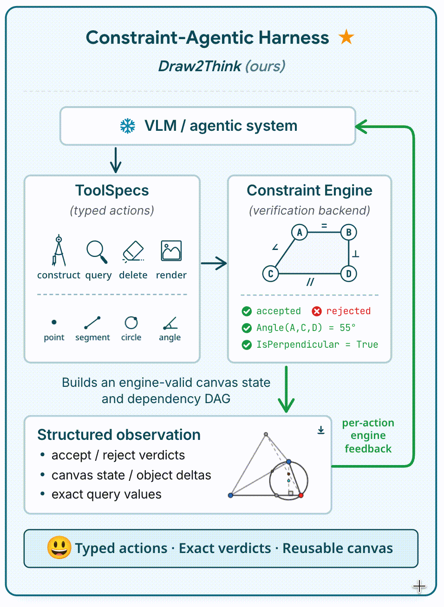

<h1 align="center">Draw2Think: Harnessing Geometry Reasoning through Constraint Engine Interaction</h1>

<p align="center">
  <a href="https://arxiv.org/abs/2605.20743"></a>
  <a href="https://www.alphaxiv.org/abs/2605.20743"></a>
  <a href="https://draw2think.github.io/"></a>
</p>

<p align="center">
  <a href="https://chengdobbs.github.io">Juncheng Hu</a><sup>1,2,3</sup> &middot;
  <a href="https://scholar.google.com/citations?user=WrJKEzEAAAAJ">Jiawei Du</a><sup>2,3</sup> &middot;
  <a href="https://zhangxin-xd.github.io/">Xin Zhang</a><sup>2,3</sup> &middot;
  <a href="https://joeyzhouty.github.io/">Joey Tianyi Zhou</a><sup>2,3</sup>
</p>

<p align="center">
  <sup>1</sup><a href="https://cde.nus.edu.sg/">NUS</a> &nbsp;
  <sup>2</sup><a href="https://www.a-star.edu.sg/cfar">CFAR, A*STAR</a> &nbsp;
  <sup>3</sup><a href="https://www.a-star.edu.sg/ihpc">IHPC, A*STAR</a>
</p>

---

## What is Draw2Think?

**Draw2Think** is a training-free constraint-agentic harness for geometry reasoning: a frozen VLM dispatches typed ToolSpecs to an executable constraint engine. This repo contains the harness, ToolSpecs, eval scripts, ablations, and reproduction entry points.

### The Propose-Draw-Verify (PDV) loop

A frozen VLM proposes typed actions; the engine updates a shared canvas and returns structured observations. As an agent-systems stack, the harness has seven layers. ▶ **[See it live](https://draw2think.github.io/#focus=paradigms)**.

<table>
<tr>
<th width="45%" align="center">Constraint-agentic harness<br>(Draw2Think, ours)</th>
<th width="1%" align="center" style="white-space: nowrap; padding: 3px 6px;">Harness Layer</th>
<th width="54%" align="left">What it governs → code</th>
</tr>
<tr><td rowspan="7" valign="top"></td><td align="center" style="white-space: nowrap; padding: 3px 6px;"><b>L1</b><br>Context</td><td><b>sees only verified state</b><br>problem + ToolSpecs + history → <code>prompts/</code></td></tr>
<tr><td align="center" style="white-space: nowrap; padding: 3px 6px;"><b>L2</b><br>Tools</td><td><b>typed ToolSpec interface</b><br>schemas / preconditions → <code>tools/</code></td></tr>
<tr><td align="center" style="white-space: nowrap; padding: 3px 6px;"><b>L3</b><br>Orchestration</td><td><b>model routes tool use</b><br>turn-level routing → <code>test_agentic…</code></td></tr>
<tr><td align="center" style="white-space: nowrap; padding: 3px 6px;"><b>L4</b><br>Memory</td><td><b>canvas state + trace</b><br>objects / DAG / styling → <code>CanvasTracker</code></td></tr>
<tr><td align="center" style="white-space: nowrap; padding: 3px 6px;"><b>L5</b><br>Verification</td><td><b>fidelity + faithfulness</b><br>construction checks → <code>geogoal/</code></td></tr>
<tr><td align="center" style="white-space: nowrap; padding: 3px 6px;"><b>L6</b><br>Recovery</td><td><b>reject → rollback → recover</b><br>repair / escape → <code>execute()</code></td></tr>
<tr><td align="center" style="white-space: nowrap; padding: 3px 6px;"><b>L7</b><br>Supervision</td><td><b>external engine sandbox</b><br>audit boundary → <code>geogebra_api.py</code></td></tr>
</table>

---

## Repository Map

| Path | What | Details |
|---|---|---|
| `symbolic/` | core library: engine bridge, typed ToolSpecs, model registry | [`symbolic/README`](symbolic/README.md) |
| `eval/` | harness eval: PDV constructor, baselines, benchmark evals, ablations | [`eval/README`](eval/README.md) |
| `tests/` | ToolSpec, engine bridge, and pipeline smoke tests | [`tests/README`](tests/README.md) |

---

## Installation

Requires Python >= 3.10 and >=4 GB RAM. `bootstrap` prepares the `.env` template, Chrome for Testing, ChromeDriver, then runs a Selenium smoke test. We recommend `--offline-bundle` for stable reproduction. An agentic coding framework can inspect the repo and help run the bootstrap/doctor steps.

```bash
git clone https://github.com/draw2think/harness-geometry.git
cd harness-geometry
conda create -n symbolic python=3.10 -y && conda activate symbolic
pip install -e .
```
```bash
python setup.py bootstrap --offline-bundle # (recommended) local bundle [~110MB]

python setup.py bootstrap   # online CDN-backed runtime
python setup.py download_manual   # (opt) official reference docs
```

If your cluster blocks browser downloads, install Chrome/Chromium manually or set `DRAW2THINK_CHROME` and `DRAW2THINK_CHROMEDRIVER`:

```bash
# Ubuntu/Debian
sudo apt-get update && sudo apt-get install -y chromium

# Cluster / no sudo
conda install -c conda-forge chromium -y
```

### API keys

`python setup.py bootstrap` writes a blank `.env` template to the project root and leaves an existing `.env` untouched. Fill in only the providers you run; the default Gemini constructor needs `GOOGLE_API_KEY`, judge-based evals (GenExam) additionally need an OpenAI-compatible key. Use `python setup.py create_env` to regenerate the template separately.

Official key consoles: [Google AI Studio](https://aistudio.google.com/api-keys), [OpenAI](https://platform.openai.com/api-keys), [Anthropic](https://platform.claude.com/settings/keys).

Additional included in registry: [Moonshot Intl](https://platform.moonshot.ai/console/api-keys) / [CN](https://platform.moonshot.cn/console/api-keys), [Z.ai](https://z.ai/manage-apikey/apikey-list) / [BigModel CN](https://bigmodel.cn/apikey/platform), [DeepSeek](https://platform.deepseek.com/api_keys), [Alibaba Intl](https://modelstudio.console.alibabacloud.com/ap-southeast-1?tab=dashboard#/api-key) / [Bailian CN](https://bailian.console.alibabacloud.com/cn-beijing).

> **Practical observation for stable reproducibility.** Use native provider keys for reported results. Low-price third-party proxies may lack quality guarantees and can introduce provider-side numerical or routing perturbations under the same model name, temperature-0 setting, and seed. Avoid unauthorized resellers for reproducibility and key-safety reasons.

### Datasets

```bash
python eval/download_datasets.py # list datasets and local status
python eval/download_datasets.py --download <dataset-id>
python eval/download_datasets.py --download all
```

---

## Quick Start

List available models:

```bash
python -m symbolic.utils.model_registry --vision --tool-calling --thinking
```

**Agentic construction (CT):** the PDV constructor:

```bash
python eval/test_agentic_geo_constructer.py \
    --dataset pgps9k --data_dir /data/PGPS9K \
    --mode construct --sample 50 --workers 4
```

**Baseline (BL):** single-turn, no tools; the direct-VLM comparison reported in the paper:

```bash
python eval/eval_baseline.py --dataset pgps9k --data_dir /data/PGPS9K --sample 50
```

Key flags (constructor): `--mode construct|direct`, `--model <registry-id>`, `--sample N` (`--sample 0` for full set; default is `10`), `--workers N`, `--skip-done` (resume), `--thinking minimal|low|medium|high`, `--id <problem-id>` (explicit IDs skip sampling).

---

## Reproducing Every Paper Result

| Paper claim | Command |
|---|---|
| Outcome accuracy, CT (main table) | `python eval/test_agentic_geo_constructer.py --mode construct ...` |
| Outcome accuracy, BL (no-tool baseline) | `python eval/eval_baseline.py ...` |
| GeoGoal construction fidelity (SR/SC) | `python eval/geogoal/eval_geogoal.py --data /data/geogoal_sgvr` |
| GeoGoal fidelity-conditioned answer quality | `python Writing/figs/geogoal_sgvr/fidelity_bars.py` |
| GeoGoal `T_i` tolerance sweep | `python Writing/figs/geogoal_sgvr/tol_sweep.py` |
| GenExam-math 68.2% / 90.5% rendering | `python eval/eval_genexam.py --generate-only` → `--judge-only` → `--score-only` |
| Query / Delete / Description ablations (§5) | `python eval/ablation_wo_query.py`, `python eval/ablation_wo_delete.py`, `python eval/ablation_description_run.py` |
| Answer-source taxonomy | `python eval/analyze_answer_source.py` |
| Re-score saved runs without re-querying the model | `python eval/rescore_from_logs.py` |

Paper-specific entry points:

**GeoGoal**

```bash
python eval/geogoal/eval_geogoal.py --data /data/geogoal_sgvr --sample 10
python Writing/figs/geogoal_sgvr/fidelity_bars.py
python Writing/figs/geogoal_sgvr/tol_sweep.py
```

**GenExam**

```bash
python eval/eval_genexam.py --data_dir /data/genexam --sample 10 --generate-only
python eval/eval_genexam.py --judge-only
python eval/eval_genexam.py --score-only
```

**Ablations**

```bash
python eval/ablation_wo_query.py --ablation-mode wo_query_17 --bench mathverse --skip-done
python eval/ablation_wo_delete.py --bench mathverse
python eval/ablation_description_run.py --level bare --bench mathverse --workers 4
```

Default run parameters (model, max turns = 30, temperature = 0, thinking level) live in `eval/eval_config.py`; CLI flags override them. Per-benchmark recipes and the full result schema are in [`eval/README`](eval/README.md).

---

## Live Human-in-the-Harness

Click any preview to open the GUI walkthrough with model traces, engine outputs, and live canvas states.

<table>
<tr>
<td width="25%" align="center"><a href="http://localhost:8765/#demo"></a></td>
<td width="25%" align="center"><a href="http://localhost:8765/#demo"></a></td>
<td width="25%" align="center"><a href="http://localhost:8765/#demo"></a></td>
<td width="25%" align="center"><a href="http://localhost:8765/#demo"></a></td>
</tr>
</table>

---

## Citation

```bibtex
@article{hu2026draw2think,
  title   = {Draw2Think: Harnessing Geometry Reasoning through Constraint Engine Interaction},
  author  = {Hu, Juncheng and Du, Jiawei and Zhang, Xin and Zhou, Joey Tianyi},
  journal = {arXiv preprint arXiv:2605.20743},
  year    = {2026},
  url     = {https://draw2think.github.io}
}
```

## License & Acknowledgements

Released under the [MIT License](LICENSE).

Draw2Think uses [GeoGebra](https://www.geogebra.org/) and Giac CAS backends, fetched on demand under their own [licenses](https://www.geogebra.org/license). See [`NOTICE`](NOTICE).
